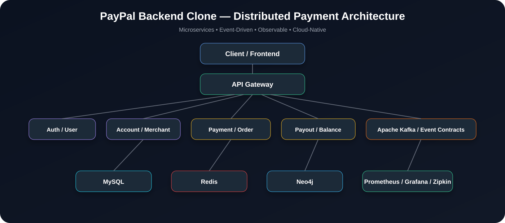
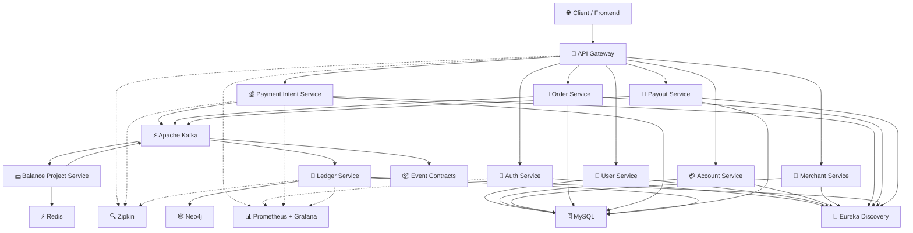

<div align="center">



# 💳 PayPal Backend Clone

### Production-Grade Distributed Payment Platform

A **highly scalable, event-driven payment backend** inspired by modern payment platforms, built with **Spring Boot microservices**, **Apache Kafka**, **Redis**, **MySQL**, **Neo4j**, and a complete **observability stack**.

<p>
  
  
  
  
</p>

<p>
  
  
  
  
</p>

<p>
  
  
  
</p>

<p>
  
  
  
</p>

**⚠️ Educational Project:** This project is designed to demonstrate production-oriented backend engineering and distributed-systems concepts. It is **not affiliated with or endorsed by PayPal**.

</div>

---

## 🚀 What Is This?

This project is a **PayPal-like payment backend** designed around the principles used in large-scale financial systems:

- 🔐 Secure authentication and authorization
- 💰 Payment intent and transaction processing
- 👛 Wallet/account management
- 📒 Double-entry-style ledger concepts
- ⚡ Event-driven communication using Kafka
- 🚀 Redis-powered caching and fast data access
- 🕸️ Transaction relationship modelling with Neo4j
- 🛡️ Fault tolerance and resilient service boundaries
- 📊 Metrics, dashboards, and distributed tracing
- 🐳 Containerized local development
- ☸️ Kubernetes-ready deployment

The goal is not simply to build CRUD APIs — it is to understand **how a distributed payment system can be designed, communicated, observed, and operated**.

---

## ✨ Core Highlights

| Capability | Implementation |
|---|---|
| 🧩 Microservices | Spring Boot |
| 🚪 API Entry Point | Spring Cloud Gateway |
| 🔎 Service Discovery | Eureka |
| ⚡ Event Streaming | Apache Kafka |
| ⚡ Caching | Redis |
| 💾 Relational Storage | MySQL |
| 🕸️ Graph Storage | Neo4j |
| 📈 Metrics | Prometheus |
| 📊 Visualization | Grafana |
| 🔍 Distributed Tracing | Zipkin |
| 🐳 Containers | Docker / Docker Compose |
| ☸️ Orchestration | Kubernetes |
| 🏗️ Build System | Maven |
| ☕ Runtime | Java 17 |

---

# 🏗️ Architecture

The platform follows a **domain-oriented microservice architecture** where services own their responsibilities and communicate through synchronous APIs where required and **Kafka events for asynchronous workflows**.



> The architecture is intentionally designed around **independent services, asynchronous events, clear domain boundaries, and observability**.

---

# 🧩 Microservices

### 🚪 API Gateway
Central entry point for external requests.

**Responsibilities**
- Request routing
- Cross-cutting concerns
- Authentication propagation
- Rate limiting / gateway policies
- Service discovery integration

---

### 🔐 Auth Service
Responsible for identity and authentication.

**Responsibilities**
- User authentication
- Credential validation
- Token generation
- Authorization-related flows

---

### 👤 User Service
Owns user profile and user-domain information.

**Responsibilities**
- User registration data
- Profile management
- User lookup
- User lifecycle operations

---

### 💳 Account Service
Manages customer financial accounts / wallet-like account state.

**Responsibilities**
- Account creation
- Account status
- Balance-related account metadata
- Account ownership

---

### 🏪 Merchant Service
Manages merchant-specific information.

**Responsibilities**
- Merchant onboarding
- Merchant profiles
- Merchant configuration
- Merchant lifecycle

---

### 💰 Payment Intent Service
The entry point for payment processing.

**Responsibilities**
- Create payment intents
- Validate payment requests
- Track payment lifecycle
- Publish payment events

Typical flow:

```text
CREATE_PAYMENT
      ↓
VALIDATE
      ↓
PAYMENT_PROCESSING
      ↓
PAYMENT_SUCCEEDED / PAYMENT_FAILED
      ↓
PUBLISH EVENT
```

---

### 🛒 Order Service
Owns payment-related order information.

**Responsibilities**
- Create orders
- Maintain order state
- Associate orders with payment intents
- Publish order events

---

### 💵 Balance Project Service
Maintains derived balance projections using events.

```text
Kafka Event
    ↓
Balance Projector
    ↓
Update Redis / Read Model
```

This approach keeps frequently accessed balance information fast while the ledger remains the authoritative financial record.

---

### 📒 Ledger Service

The ledger is one of the most important parts of the system.

Instead of treating a payment as simply:

```text
balance = balance - amount
```

the system models financial activity as **immutable transaction records**.

Conceptually:

```text
Payment
   │
   ├── Debit Account A
   │
   └── Credit Account B
```

This makes the system much easier to audit, reconcile, and reason about.

---

### 🏦 Payout Service

Handles outgoing money movement.

```text
Payout Request
      ↓
Validation
      ↓
Payout Processing
      ↓
Kafka Event
      ↓
Ledger
      ↓
Balance Projection
```

---

### 🕸️ Transaction Graph

Neo4j can be used to model relationships between:

```text
User
 ↓
Account
 ↓
Transaction
 ↓
Merchant
 ↓
Payment
```

This enables relationship-based analysis and provides a foundation for future capabilities such as:

- Transaction relationship exploration
- Fraud-pattern analysis
- Suspicious transaction detection
- Graph-based risk analysis

---

# ⚡ Event-Driven Architecture

Kafka is used to decouple services and support asynchronous workflows.

Example:

```text
Payment Intent Service
          │
          │ PaymentCreated
          ▼
      Apache Kafka
          │
    ┌─────┼───────────┐
    ▼     ▼           ▼
 Ledger  Balance    Notification
 Service Projector    Service
```

### Example Events

```text
PaymentCreated
PaymentProcessing
PaymentSucceeded
PaymentFailed
OrderCreated
PayoutRequested
PayoutCompleted
LedgerEntryCreated
```

Keeping event contracts separately also helps maintain **stable communication boundaries** between services.

---

# 🔄 Payment Flow

A simplified payment lifecycle:

```text
Client
  │
  ▼
API Gateway
  │
  ▼
Payment Intent Service
  │
  ├──────────────► MySQL
  │
  ▼
Kafka
  │
  ├──────────────► Ledger Service
  │
  ├──────────────► Balance Projector
  │
  └──────────────► Notification / Other Consumers
                         │
                         ▼
                    Final State
```

### Why Kafka?

Because payment processing often involves multiple independent side effects.

Instead of tightly coupling:

```text
Payment → Ledger → Balance → Notification
```

the system can publish an event:

```text
PaymentSucceeded
```

and allow multiple consumers to react independently.

This improves:

- Scalability
- Loose coupling
- Failure isolation
- Extensibility
- Event replay possibilities

---

# 🗄️ Data Architecture

The system intentionally uses different databases for different workloads.

### MySQL

Used for transactional domain data:

```text
Users
Accounts
Merchants
Orders
Payments
Payouts
Ledger records
```

### Redis

Used for low-latency access and projections:

```text
Balance Read Models
Cache
Temporary State
Rate Limiting
```

### Neo4j

Used for relationship-oriented transaction data:

```text
User ──► Account
Account ──► Transaction
Transaction ──► Merchant
Transaction ──► Payment
```

This follows a **polyglot persistence** approach where the storage technology is selected according to the access pattern.

---

# 📊 Observability

Production systems need to answer three questions:

```text
What is happening?
        ↓
Prometheus

Why is it happening?
        ↓
Zipkin

Can I visualize it?
        ↓
Grafana
```

### Prometheus

Collects application and infrastructure metrics.

### Grafana

Provides dashboards for:

- Request rates
- Error rates
- Latency
- JVM metrics
- Service health
- Kafka-related metrics

### Zipkin

Provides distributed tracing across service boundaries.

Example:

```text
Gateway
   ↓
Payment Service
   ↓
Kafka
   ↓
Ledger Service
   ↓
Balance Projection
```

Tracing makes it possible to follow a request/workflow across distributed components.

---

# 🐳 Local Development

## Prerequisites

Make sure you have:

- Java 17+
- Maven 3.8+
- Docker
- Docker Compose
- Git

Optional:

- Kubernetes
- Minikube
- kubectl

---

## Clone the Repository

```bash
git clone https://github.com/yashdotdev13/paypal-backend-clone.git

cd paypal-backend-clone
```

---

## Start Infrastructure

```bash
docker compose up -d
```

Check running containers:

```bash
docker ps
```

---

## Build the Project

```bash
mvn clean install
```

Run a specific service:

```bash
cd payment-intent-service
mvn spring-boot:run
```

> Service-specific configuration and startup instructions can be added as the project evolves.

---

# ☸️ Kubernetes

The repository also contains Kubernetes deployment resources.

```text
k8s/
├── namespaces/
├── deployments/
├── services/
├── configmaps/
└── secrets/
```

Typical deployment:

```bash
kubectl apply -f k8s/
```

Verify:

```bash
kubectl get pods
kubectl get services
```

---

# 🧪 Testing Strategy

The project is intended to evolve toward multiple levels of testing:

```text
Unit Tests
    ↓
Integration Tests
    ↓
Service Tests
    ↓
Event / Kafka Tests
    ↓
End-to-End Tests
```

Important areas include:

- Payment state transitions
- Ledger consistency
- Idempotency
- Event processing
- Failure recovery
- Account/balance consistency
- Authentication and authorization

---

# 🛡️ Reliability & Distributed Systems Concepts

This project focuses heavily on real-world backend engineering concepts.

### Idempotency

Payment APIs should be designed so that retrying the same request does not accidentally create duplicate financial operations.

```text
Request
   ↓
Idempotency Key
   ↓
Check Existing Operation
   ↓
Process Only Once
```

### Eventual Consistency

Not every read model needs to update synchronously.

```text
Authoritative Ledger
        ↓
      Kafka
        ↓
  Balance Projection
```

The projection may become consistent shortly after the source transaction is committed.

### Fault Isolation

If one consumer temporarily fails:

```text
Payment Service
      ↓
    Kafka
      ↓
Ledger Consumer ❌
      ↓
Retry / Recovery
```

the payment workflow does not necessarily have to synchronously wait for every downstream component.

---

# 📁 Repository Structure

```text
paypal-backend-clone/
│
├── account-service/
├── api-gateway/
├── auth-service/
├── balance-project-service/
├── discovery-server/
├── event-contracts/
├── init-db/
├── k8s/
├── kafka-kraft/
├── ledger-service/
├── merchant-service/
├── monitoring/
├── order-service/
├── payment-intent-service/
├── payout-service/
├── user-service/
│
├── docker-compose.yml
├── pom.xml
└── README.md
```

---

# 🗺️ Project Status

## ✅ Completed

This project is considered **complete** and represents the finished implementation of the distributed payment backend.

- [x] Microservice foundation
- [x] API Gateway
- [x] Service Discovery
- [x] Authentication & authorization
- [x] Account / wallet management
- [x] User management
- [x] Merchant management
- [x] Payment intent lifecycle
- [x] Order management
- [x] Balance projection
- [x] Ledger service
- [x] Payout processing
- [x] Kafka event-driven communication
- [x] Event contracts
- [x] Idempotency
- [x] Retry / failure-handling patterns
- [x] Distributed transaction / workflow patterns
- [x] MySQL persistence
- [x] Redis caching / read projections
- [x] Neo4j transaction graph
- [x] Docker & Docker Compose
- [x] Kubernetes deployment resources
- [x] Prometheus metrics
- [x] Grafana dashboards
- [x] Zipkin distributed tracing
- [x] Production-oriented security practices
- [x] Integration / event-driven testing
- [x] Observability-first architecture
- [x] Fault-tolerant service design

> **Status: 🟢 Complete** — The repository represents the finished project rather than an ongoing roadmap.

---

# 📚 Engineering Principles

This project follows several important backend engineering principles:

```text
Domain Separation
       +
Event-Driven Communication
       +
Database Per Service
       +
Idempotency
       +
Observability
       +
Fault Tolerance
       +
Horizontal Scalability
       +
Clean Architecture
```

The objective is to understand **why** these patterns exist, not simply to use technologies because they are popular.

---

# 🎯 What This Project Demonstrates

If you're reviewing this repository as a backend / distributed-systems project, the major engineering areas are:

### Backend Engineering
- Spring Boot
- REST APIs
- Authentication
- Database design
- Transaction management

### Distributed Systems
- Microservices
- Event-driven architecture
- Kafka
- Eventual consistency
- Idempotency
- Failure handling

### Data Engineering
- MySQL
- Redis
- Neo4j
- Polyglot persistence
- Read projections

### DevOps
- Docker
- Docker Compose
- Kubernetes
- CI/CD
- Infrastructure automation

### Observability
- Prometheus
- Grafana
- Zipkin
- Metrics
- Distributed tracing

---

# 🤝 Contributing

Contributions, ideas, improvements, and architecture discussions are welcome.

```bash
git checkout -b feature/your-feature
git commit -m "feat: add your feature"
git push origin feature/your-feature
```

Then open a Pull Request.

---

# ⚠️ Disclaimer

This project is an **independent educational implementation inspired by payment-platform architecture**.

It is **not affiliated with, sponsored by, or endorsed by PayPal**.

Do not use this project to process real money or sensitive financial information without appropriate security, compliance, auditing, and regulatory controls.

---

# 👨‍💻 Author

<div align="center">

### Yash Chauhan

Building distributed systems, cloud-native applications, and production-oriented backend platforms.

<p>
  <a href="https://github.com/yashdotdev13">
    
  </a>
</p>

</div>

---

<div align="center">

### ⭐ If you find this project useful, consider giving it a star!

**Built with ☕ Java, ⚡ Kafka, 🐳 Docker & ❤️ curiosity about distributed systems.**

</div>
